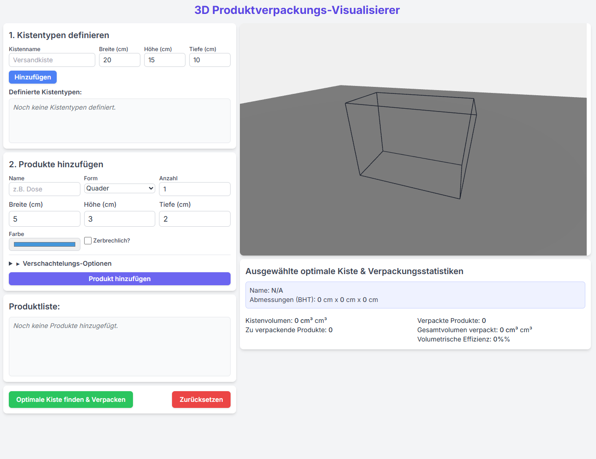

# 📦 3D Packer - Product Packaging Visualizer 🚀

Ever wondered how to best fit your items into a shipping box? Or perhaps you're designing packaging and want to see how things stack up? **3D Packer** is here to help!

This tool lets you define different box sizes and a list of products, then magically figures out an efficient way to pack them, showing you a 3D visualization of the result. It's like playing Tetris, but for your packages!


*(You should totally replace the image above with a GIF or screenshot of your app in action!)*

## ✨ Cool Features

*   **Define Your Boxes:** Create a list of available box sizes with their specific dimensions (width, height, depth).
*   **Add Your Products:**
    *   Specify different product shapes: 🧊 Cuboids,  cylindrical 🥫 Cans, or even round 🔮 Spheres!
    *   Add multiple quantities of each product.
    *   Give each product a unique color for easy identification.
    *   Mark products as "fragile" – the packer will try not to stack heavy things on them!
    *   **Nesting Magic!**  nesting_dolls: Some products can act as containers for smaller items, and some items can be marked to be placed inside others.
*   **Smart Packing:** Click a button, and the app finds a suitable box and attempts to pack your items efficiently.
*   **Interactive 3D View:** See your products neatly (or sometimes, creatively!) arranged inside the chosen box. You can rotate and zoom to inspect the packing from all angles.
*   **Packing Stats:** Get useful information like:
    *   Which box was chosen.
    *   How much of the box volume is used (volumetric efficiency).
    *   How many items were successfully packed.

## 🎮 How to Use (It's Easy!)

1.  **Set Up Your Boxes:**
    *   Go to the "1. Define Box Types" section.
    *   Enter a name for your box (e.g., "Small Shipper", "Big Box").
    *   Input its width, height, and depth in centimeters.
    *   Click "Add". Repeat for all box sizes you want to consider.

2.  **List Your Products:**
    *   Move to the "2. Add Products" section.
    *   Give your product a name (e.g., "Book", "Mug", "Tennis Ball").
    *   Choose its shape (Box, Cylinder, Sphere) and enter its dimensions.
    *   Set the quantity and pick a color.
    *   Check "Fragile?" if it needs careful handling.
    *   Explore the "Nesting Options" if you have items that can go inside others or act as containers.
    *   Click "Add Product". Add all items you want to pack.

3.  **Pack 'Em Up!**
    *   Once your boxes and products are defined, hit the **"Find Optimal Box & Pack"** button.
    *   Watch the 3D view update to show the packed items!
    *   Check the "Selected Optimal Box & Packing Statistics" to see how well everything fits.

4.  **Reset & Try Again:**
    *   Want to start over? The **"Reset"** button clears everything.

## 🛠️ Tech Behind the Magic

This project brings together a few cool technologies:

*   **Three.js:** For all the 3D rendering and visualization. This is what makes the boxes and products appear on your screen.
*   **Tailwind CSS:** To make the user interface look clean and modern without a lot of custom CSS.
*   **HTML, CSS, JavaScript:** The classic building blocks of the web.
*   **(Potentially) Tauri:** The project includes configuration files for Tauri, which means it can be bundled into a cross-platform desktop application!

## 🚀 Getting Started (For Developers)

If you want to run this project locally or contribute:

1.  **Clone the repository:**
    ```bash
    git clone https://github.com/your-username/your-repo-name.git
    cd your-repo-name
    ```

2.  **Install dependencies:**
    (Make sure you have Node.js and npm installed)
    ```bash
    npm install
    ```

3.  **Run in development mode:**
    *   For the web version:
        ```bash
        npm run dev
        ```
        This will usually open the app in your browser at `http://localhost:1420` (or a similar address).
    *   For the Tauri desktop app (if you have Tauri prerequisites installed):
        ```bash
        npm run tauri dev
        ```

4.  **Build the project:**
    *   To build the web assets:
        ```bash
        npm run build
        ```
    *   To build the Tauri desktop application:
        ```bash
        npm run tauri build
        ```

## 💡 Future Ideas & Contributions

This project has a lot of potential! Here are some thoughts:

*   More sophisticated packing algorithms (e.g., considering item weight distribution).
*   Saving and loading box/product configurations.
*   Support for more complex product shapes.
*   Visual indication of "fragile" items in the 3D view.

Feel free to fork the project, experiment, and submit pull requests. All ideas and contributions are welcome!

---

Happy Packing! 🎉